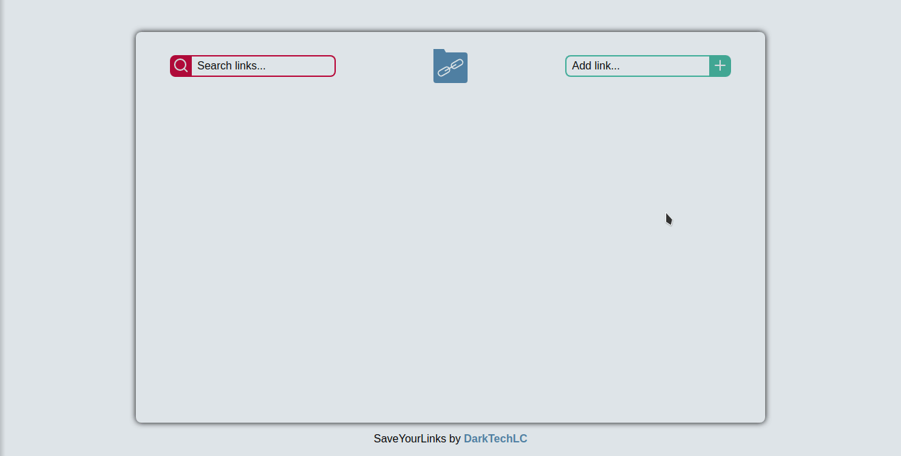

# 🔗 SaveYourLinks

## Save your favorite links to your personal computer in an organized way.



- Add a link, then the application will try to find the title and description
- Search for saved links using keywords

### To run the application, you need to have NodeJS installed, then run the following commands on a console:

```bash
$ git clone https://github.com/DarkTechLC/saveyourlinks.git
$ cd saveyourlinks
$ npm install
$ npm start
```
